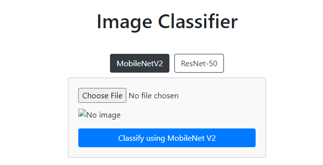
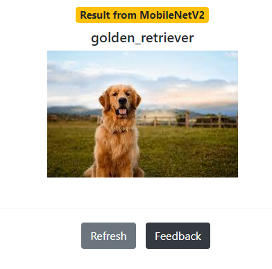
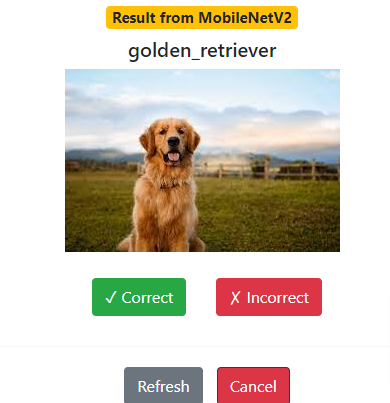

# Image Classifier - Object Recognition



## About this Project

**Project Name**: Image Classifier - Object Recognition

**Description**:
The "Image Classifier - Object Recognition" project is a powerful web application that utilizes machine learning to identify and classify various objects in uploaded images. The application uses two state-of-the-art pre-trained deep learning models: MobileNetV2 and ResNet-50. Users can upload images to the web app, and the system will instantly recognize and categorize the objects present in the images.

**Technologies Used**:
- Python: The backend of the web application is built using Python and the Flask web framework.
- TensorFlow: The project employs TensorFlow, a widely used deep learning library, to work with the pre-trained machine learning models.
- Keras: Keras, a high-level neural networks API, is used in conjunction with TensorFlow for model handling.
- HTML/CSS/JavaScript: The frontend of the web app is designed using standard web technologies, creating an engaging and interactive user experience.
- PIL/Pillow: The Python Imaging Library (PIL) or Pillow is used for image processing tasks, such as resizing and opening images.


## Installation

1. Clone this repository to your local machine:

```bash
git clone https://github.com/mustafaemresahin/image-classifier.git
```
2. Navigate to the project directory:
```bash
cd image-classifier
```
3. Create a virtual environment (optional but recommended):
```bash
python3 -m venv venv
```
4. Activate the virtual environment
```bash
source venv/bin/activate
```
5. Install the required packages:
```bash
pip install -r requirements.txt
```
6. Run the Flask application:
```bash
python app.py
```
Open your web browser and navigate to http://localhost:5000 to access the application.

## How to Use

1. Click on the "Choose Image" button to select an image from your computer or device.
2. Once an image is selected, click the "Classify using MobileNetV2" button to get the classification result using the MobileNetV2 model or click the "ResNet-50" button to use the ResNet-50 model.
3. The result will be displayed on the page, showing the objects identified in the image and their corresponding labels.
4. Users can explore the versatility of the model by uploading various images, and the system will accurately recognize and classify different objects.



## Feedback

- Users have the option to provide feedback on the classification results. After the image is classified, you will see a "Feedback" button on the screen.
- Click on the "Feedback" button to provide your feedback.
- Two buttons will appear, allowing you to choose one of two options:
  - &#10003; Correct: If you agree with the classification result and find it accurate.
  - &#10007; Incorrect: If you disagree with the classification result and believe it to be inaccurate.
- Select the appropriate option based on your assessment of the classification.



## Purpose

The main purpose of this project is to showcase the capabilities of deep learning models in real-world image recognition applications. By building an image classifier that can recognize a wide range of objects, the project demonstrates the potential of machine learning in various industries, such as healthcare, automotive, agriculture, and more. The application not only serves as a valuable tool for object recognition but also provides an educational and engaging experience for users interested in machine learning concepts.

---

Feel free to contribute, enhance, or modify this project!
